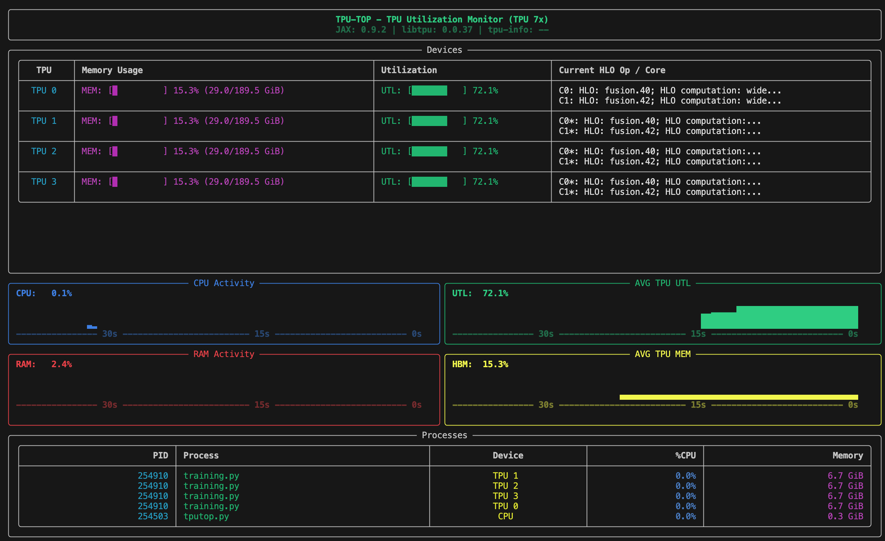

# TPU-TOP

A modern, terminal-based monitoring dashboard for Google Cloud TPUs, designed to give you real-time visibility into your machine's performance.

## Project Overview

`tpu-top` provides a visual, interactive TUI (Terminal User Interface) to monitor system and TPU resources. It is specifically tailored for high-performance computing environments like GKE (Google Kubernetes Engine) where deep learning models are trained on TPUs.



### Key Features

*   **2x2 Metric Grid**: Real-time tracking of CPU, RAM, Average TPU Utilization, and Average TPU HBM (Memory).
*   **Visual Bar Charts**: Multi-line vertical bar charts filling the display boxes to show resource usage scaling up to 100%.
*   **Device Status Table**: Detailed per-device breakdown showing duty cycle and memory usage for each local TPU chip.
*   **Process Monitor**: Lists active processes consuming CPU or TPU resources on the host.
*   **Google Brand Styling**: Color-coded graphs using Google's signature color palette (Blue, Red, Yellow, Green).
*   **Version Awareness**: Displays JAX, libtpu, and tpu-info versions directly in the header alongside detected TPU generation.

## Installation

You can install `tpu-top` directly from the source directory.

### Prerequisites

Ensure you have Python 3.8+ and access to a Cloud TPU environment. The tool relies on `tpu-info` to communicate with the TPU driver.

### Standard Install

Navigate to the project root directory and run:

```bash
pip install .
```

### Developer Install

If you are making modifications and want them to reflect immediately:

```bash
pip install -e .
```

## How to Use

Once installed, you can launch the dashboard from anywhere in your terminal:

```bash
tpu-top
```

### Environment Variables

*   `TPU_TOP_MOCK=1`: Force mock mode for testing on machines without physical TPUs.
*   `TPU_TOP_ITERATIONS=N`: Run for exactly `N` refresh cycles and exit (useful for automated tests).

## Running Tests

To validate changes, run the unit tests:

```bash
python -m unittest test_main.py
```
(Note: If testing inside a GKE container, ensure dependencies are installed in your target environment).

